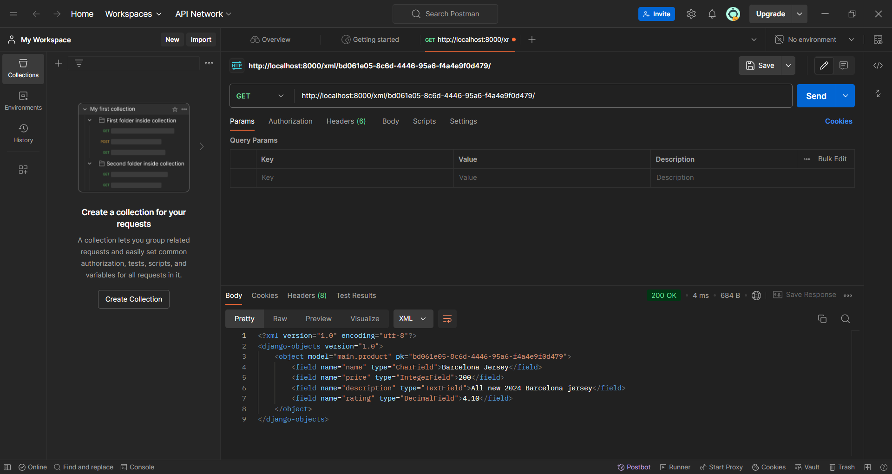

# vin-shop
## Link : http://kevin-adriano-vinshop.pbp.cs.ui.ac.id/login/?next=/

## assignment 2

### 1. Create a new Django project:

Use django-admin startproject vin_shop . to create a new project. This command sets up the essential files for a Django project, including settings.py and urls.py.

### 2. Create an application named "main":

create a new application called main inside the project file project by running python manage.py startapp main
views.py, models.py, and urls.py will be added for handling the logic of the app.

### 3. Perform routing for the "main" app:

you need to open the urls.py file inside of the vin_shop project directory and add:

```
urlpatterns = [
    ...
    path('', include('main.urls')),
    ...
]
```

### 4. Create a Product model in models.py:

Define the models in main/models.py
create class Product and add
name as Charfield with 100 character max
price as IntegerField 
description as TextField
rating as DecimalField

```
from django.db import models

class Product(models.Model):
    name = models.CharField(max_length=100)
    price = models.IntegerField()
    description = models.TextField()
    rating = models.DecimalField(max_digits=3, decimal_places=2)

    def __str__(self):
        return self.name
```
Run python manage.py makemigrations and python manage.py migrate to apply the database changes.

### 5. make the html file
create a file name templates  in your main directory and make a html file named main.html
in the main.html input this

```
<!DOCTYPE html>
<html lang="en">
<head>
    <meta charset="UTF-8">
    <meta name="viewport" content="width=device-width, initial-scale=1.0">
    <title>main</title>
</head>
<body>
    <h1>{{ app_name }}</h1>
    <p>Name: {{ name }}</p>
    <p>npm: {{ npm }}</p>
    <p>Class: {{ class }}</p>
</body>
</html>
```

### 6. Create a function in views.py:
In views.py, add:

```
from django.shortcuts import render
# Create your views here.

def show_main(request):
    context = {
        'app_name' : 'vin-shop',
        'name': 'Kevin Adriano',
        'npm': '2306172552',
        'class': 'PBP KKI',
    }

    return render(request, "main.html", context)
```

views.py acts as the middleman between the Model and the Template. The View doesn’t directly render HTML; instead, it hands off the data and the template to Django’s template engine, which then generates the final HTML.

### 7. Create routing for the about view:

Create a urls.py file in the main directory and add:

```
from django.urls import path
from main.views import show_main

app_name = 'main'

urlpatterns = [
    path('', show_main, name='show_main'),
]
```

### 8. Perform deployment to PWS


1. Access the PWS page
2. Login into your account
3. Create a new project
4. Store your credentials for the project somewhere safe
5. add the PWS deployment URL to the allowed host
```

ALLOWED_HOSTS = ["localhost", "127.0.0.1", "<Your PWS deployment URL>"]

```

Run the project command instruction that is in the PWS project page.


## 2. The Diagram


urls.py: urls.py directs the incoming request to a specific function in views.py based on the URL pattern. For example, if a user visits /products/, urls.py may route this to a product_list function in views.py.
views.py: A view function may interact with the database by querying or updating data using the models defined in models.py
fter processing data, the view function passes this data to an HTML template, which renders the data into a user-friendly format.
models.py: The view interacts with models to retrieve or update data in the database. For example, a view can use a model to get a list of all products or to save a new product to the database.
HTML File (Template): The final output rendered by the view, which is sent to the client as part of the HTTP response. It displays the data in a user-friendly format.


## 3. Use of Git
1: git allows developers to keep history of changes
2: git makes collab easier by enables multiple developers to collab in different branch and merging them
3: git history can be used to recover lost data
4: git allows for a structured code review process, other member can add comment on specific lines of code
5: developers can use branches to experiment new things

## 4. Reason to use Django
Django is a high level framework that simplifies complexity, allows beginner to build fully fucntional web without having to integrate many third party libraries, has comprehensive and well-organized documentation, django has a large and active community so that new developers can easily find tutorials in social media

## 5. What is ORM?
Django allows you to define your database schema using Python classes,ORM handles the translation between the object-oriented data model used in your application and the relational data model used in the database, When you create an instance of a model and save it, the ORM translates this operation into SQL commands that interact with the database, you can interact with the database using Python code rather than writing raw SQL queries

## assignment 3

### 1. why we need data delivery in implementing a platform
Data delivery plays a vital role in platform implementation by facilitating smooth communication between system components and users. It powers essential functions such as real-time interactions, data processing, and user engagement. Effective data delivery improves user experience, maintains data integrity and security, enables scalability, and ensures compliance with industry regulations.

### 2. which is better, XML or JSON? Why is JSON more popular than XML?
JSON because it is simpler, more lightweight, and easier to work with, it is more popular because JSON (JavaScript Object Notation) has a straightforward structure that's easy to read and write, using key-value pairs and arrays, JSON has less syntactical overhead than XML, JSON is native to JavaScript, JSON is more human-readable and easier to understand

### 3. functional usage of is_valid() method in Django forms. Also explain why we need the method in forms.
The is_valid() method in Django forms is used to validate form data and check whether the form's input conforms to the specified rules.
It centralizes the validation logic within the form, enabling Django to automatically verify that the data adheres to the criteria specified for each field. This prevents the processing of invalid or malicious data, ensuring that only clean, valid information is saved to the database or utilized in operations. Using is_valid() simplifies the workflow by checking for validity, processing valid data, or displaying errors if the data is invalid.

### 4.Why do we need csrf_token when creating a form in Django? What could happen if we did not use csrf_token on a Django form? How could this be leveraged by an attacker?
The csrf_token is a unique, secret token included in forms that are submitted to a Django view. It serves as a security mechanism to ensure that the form submission is coming from the legitimate user and not from an unauthorized third party. If the csrf_token is not included in a form, Django's CSRF protection won't be active, leaving the application vulnerable to CSRF attacks. An attacker could craft a malicious form on another website that submits a request to the Django application (e.g., transferring funds, changing account details) using the victim’s browser session.

### 5. Create a form input to add a model object
you need create forms.py in the main directiory add the following code:
```
from django.forms import ModelForm
from main.models import Product

class ProductForm(ModelForm):
    class Meta:
        model = Product
        fields = ["name", "price", "description", "rating"]
```

update views.py

```
def create_product_entry(request):
    form = ProductForm(request.POST or None)

    if form.is_valid() and request.method == "POST":
        form.save()
        return redirect('main:show_main')

    context = {'form': form}
    return render(request, "create_product_entry.html", context)
```

create create_product_entry.html

```
 

<h1>Add New Product Entry</h1>

<form method="POST">
  
  <table>
    {{ form.as_table }}
    <tr>
      <td></td>
      <td>
        <input type="submit" value="Add Product Entry" />
      </td>
    </tr>
  </table>
</form>


```

### 6. Add 4 views to view the added objects in XML, JSON, XML by ID, and JSON by ID formats.

add the following code in views.py 

XML
```
def show_xml(request):
    data = Product.objects.all()
    return HttpResponse(serializers.serialize("xml", data), content_type="application/xml")
```

JSON
```
def show_json(request):
    data = Product.objects.all()
    return HttpResponse(serializers.serialize("json", data), content_type="application/json")
```

XML by id
```
def show_xml_by_id(request, id):
    data = Product.objects.filter(pk=id)
    return HttpResponse(serializers.serialize("xml", data), content_type="application/xml")
```

JSON by id
```
def show_json_by_id(request, id):
    data = Product.objects.filter(pk=id)
    return HttpResponse(serializers.serialize("json", data), content_type="application/json")
```

### 7. Create URL routing for each of the views added in point 2
import and add the url path in the urls.py in the main directory

```
from django.urls import path
from main.views import show_main, create_product_entry, show_xml, show_json, show_xml_by_id, show_json_by_id


app_name = 'main'

urlpatterns = [
    path('', show_main, name='show_main'),
    path('create-product-entry', create_product_entry, name='create_product_entry'),
    path('xml/', show_xml, name='show_xml'),
    path('json/', show_json, name='show_json'),
    path('xml/<str:id>/', show_xml_by_id, name='show_xml_by_id'),
    path('json/<str:id>/', show_json_by_id, name='show_json_by_id'),
]
```

### 8. screenshots
XML and XML by id



JSON and JSON by id


## assignment 4

### difference between HttpResponseRedirect() and redirect()
HttpResponseRedirect requires a direct URL as an argument and manually sets the redirect location in the HTTP response. It's straightforward but less versatile. redirect() is a shortcut that offers more flexibility. It can accept a URL, view name, or model instance, automatically resolving to the appropriate redirect destination. Additionally, redirect() allows you to perform permanent redirects by setting a parameter, making it more convenient for various scenarios.

### how the MoodEntry model is linked with User
add this in your models.py
```
user = models.ForeignKey(User, on_delete=models.CASCADE)
```
The line user = models.ForeignKey(User, on_delete=models.CASCADE) in Django creates a foreign key relationship between the model and the User model, ensuring that when a user is deleted, all related records in the model are also deleted.

add this in your create_product_entry:
```
mood_entry = form.save(commit=False)
mood_entry.user = request.user
mood_entry.save()
return redirect('main:show_main')
```

### difference between authentication and authorization, and what happens when a user logs in? Explain how Django implements these two concepts.
Authentication: This is the process of verifying a user's identity, typically by checking credentials like a username and password.
Authorization: This process occurs after authentication and determines what actions or resources the authenticated user is allowed to access.
When a user provides their credentials (e.g., username and password), Django checks them against its database of registered users to verify the user's identity. If the credentials are correct, Django creates a session, which is stored on the server-side and identified by a session ID cookie on the user's browser. Once logged in, Django checks the user's permissions to determine what views, actions, or resources they are authorized to access, based on their role or group in the system. Django implements authentication using the auth framework and handles authorization through permissions and groups tied to users or models.

### How does Django remember logged-in users? Explain other uses of cookies and whether all cookies are safe to use.
Django tracks logged-in users using sessions and cookies. When a user logs in, Django creates a session on the server and sends a session ID cookie to the user's browser, which is sent back with each request to keep the user logged in.
Cookies can also store things like user preferences or security tokens, but they aren't always safe. They can be vulnerable to attacks like session hijacking or cross-site scripting (XSS). To protect cookies, developers can use Secure, HttpOnly, and SameSite settings to make them safer.

### Implement the register, login, and logout functions so that the user can access the application freely.

add this in view.py
```
def register(request):
    form = UserCreationForm()

    if request.method == "POST":
        form = UserCreationForm(request.POST)
        if form.is_valid():
            form.save()
            messages.success(request, 'Your account has been successfully created!')
            return redirect('main:login')
    context = {'form':form}
    return render(request, 'register.html', context)

def login_user(request):
    if request.method == 'POST':
        form = AuthenticationForm(data=request.POST)

        if form.is_valid():
            user = form.get_user()
            if user is not None:
                login(request, user)
                response = HttpResponseRedirect(reverse("main:show_main"))
                response.set_cookie('last_login', str(datetime.datetime.now()))
                return response

    else:
        form = AuthenticationForm(request)
        context = {'form': form}
        return render(request, 'login.html', context)

def logout_user(request):
    logout(request)
    response = HttpResponseRedirect(reverse('main:login'))
    response.delete_cookie('last_login')
    return response
```

make register.html:
```
 
<title>Register</title>
 

<div class="login">
  <h1>Register</h1>

  <form method="POST">
    
    <table>
      {{ form.as_table }}
      <tr>
        <td></td>
        <td><input type="submit" name="submit" value="Register" /></td>
      </tr>
    </table>
  </form>

  
  <ul>
    
    <li>{{ message }}</li>
    
  </ul>
  
</div>


```
make login.html
```



<title>Login</title>



<div class="login">
  <h1>Login</h1>

  <form method="POST" action="">
    
    <table>
      {{ form.as_table }}
      <tr>
        <td></td>
        <td><input class="btn login_btn" type="submit" value="Login" /></td>
      </tr>
    </table>
  </form>

  
  <ul>
    
    <li>{{ message }}</li>
    
  </ul>
   Don't have an account yet?
  <a href="">Register Now</a>
</div>


```

add the URL path to urlpatterns
```
    path('register/', register, name='register'),
    path('login/', login_user, name='login'),
    path('logout/', logout_user, name='logout'),
```

### make two user accounts with three dummy data each, using the model made in the application beforehand so that each data can be accessed by each account locally.


### Connect the models Product and User.
import this in models.py
```
from django.contrib.auth.models import User
```
and also add this:
```
    user = models.ForeignKey(User, on_delete=models.CASCADE)
```

views.py:
```
def create_product_entry(request):
    form = ProductForm(request.POST or None)

    if form.is_valid() and request.method == "POST":
        mood_entry = form.save(commit=False)
        mood_entry.user = request.user
        mood_entry.save()
        return redirect('main:show_main')

    context = {'form': form}
    return render(request, "create_product_entry.html", context)
```
The code establishes a relationship between the Product model and Django's User model. By adding user = models.ForeignKey(User, on_delete=models.CASCADE), each mood entry is linked to a specific user. This ensures that every Product instance is associated with a user, meaning multiple mood entries can belong to one user. The on_delete=models.CASCADE option ensures that if a user is deleted, all their associated mood entries are deleted as well, maintaining database integrity. This setup is common when creating user-specific content in Django applications.

### Display logged in user details such as username and apply cookies like last login to the application's main page.

add this in show_main function 
```
def show_main(request):
    product_entries = Product.objects.filter(user=request.user)

    context = {
        'myname': request.user.username,
        'class': 'PBP KKI',
        'product_entries': product_entries,
        'last_login': request.COOKIES['last_login'],
    }

    return render(request, "main.html", context)
```
This view function retrieves user-specific product entries from the database, collects data into a context dictionary (including the user's last login time from a cookie), and passes it to the main.html template for rendering.

and also add this in main.html to show logout button and last login
```
<a href="">
  <button>Add New Product Entry</button>
</a>
<a href="">
  <button>Logout</button>
</a>
<h5>Last login session: {{ last_login }}</h5>

```
